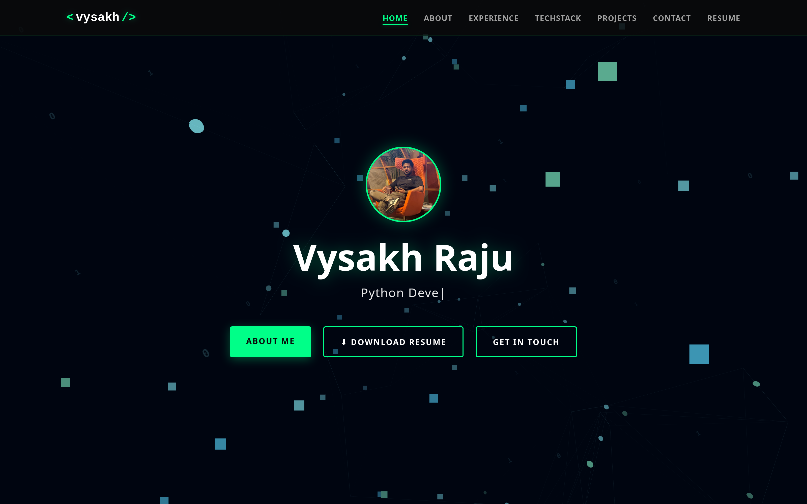

# 🧠 Living Neural Network Portfolio

A futuristic, interactive 3D portfolio website designed for AI/Python developers. It features a "Living Neural Network" background that reacts to user interaction, a hacking-themed preloader, and a clean, modern UI.


*(Note: Add a screenshot of your site here)*

## ✨ Key Features

-   **3D Interactive Background**: A procedurally generated neural network built with **Three.js**. Nodes and connections float in 3D space, pulsing with data.
-   **"Hacking" Preloader**: A Matrix-style binary rain effect with terminal typing animations and sound effects (requires user interaction).
-   **Fluid Interaction**: The 3D network reacts to your mouse, creating a force field that gently pushes nodes away.
-   **Scrollytelling**: The camera flies through the neural network as you scroll down the page.
-   **Responsive Design**: Fully optimized for desktop and mobile devices.
-   **Contact Form**: Integrated with **Formspree** for serverless email handling.

## 🛠️ Technologies Used

-   **HTML5 / CSS3**: Semantic structure and modern styling (CSS Variables, Flexbox, Grid).
-   **JavaScript (ES6+)**: Modular logic for UI and 3D scenes.
-   **Three.js**: The core library for the 3D neural network visualization.
-   **Formspree**: Backend service for the contact form.

## 🚀 Setup & Usage

1.  **Clone the repository**:
    ```bash
    git clone https://github.com/yourusername/my_portfolio.git
    cd my_portfolio
    ```

2.  **Run Locally**:
    Since this project uses ES6 modules (`import/export`), you need a local server to run it (opening `index.html` directly won't work due to CORS policies).
    
    *   **VS Code**: Install the "Live Server" extension and click "Go Live".
    *   **Python**:
        ```bash
        python3 -m http.server
        ```
        Then open `http://localhost:8000`.

## ⚙️ Customization

### 1. Contact Form
To make the contact form work, you need your own Formspree Endpoint.
1.  Go to [formspree.io](https://formspree.io/) and create a form.
2.  Open `index.html`.
3.  Replace the `action` URL in the `<form>` tag:
    ```html
    <form action="https://formspree.io/f/YOUR_FORM_ID" ...>
    ```

### 2. Social Links
Update the links in the "Social Profiles" section of `index.html` to point to your own LinkedIn, GitHub, and Instagram profiles.

### 3. Typing Effect
To change the phrases in the hero section ("Python Developer", "Gen AI Enthusiast"), edit `js/main.js`:
```javascript
const phrases = ["Your Title 1", "Your Title 2"];
```

## 📂 Project Structure

```
my_portfolio/
├── index.html       # Main entry point
├── css/
│   └── style.css    # All styles
├── js/
│   ├── main.js      # 3D scene logic (Three.js)
│   └── ui.js        # UI logic (Navbar, Preloader, Form)
└── assets/          # Images and icons
```

## 📄 License

This project is open source and available under the [MIT License](LICENSE).
