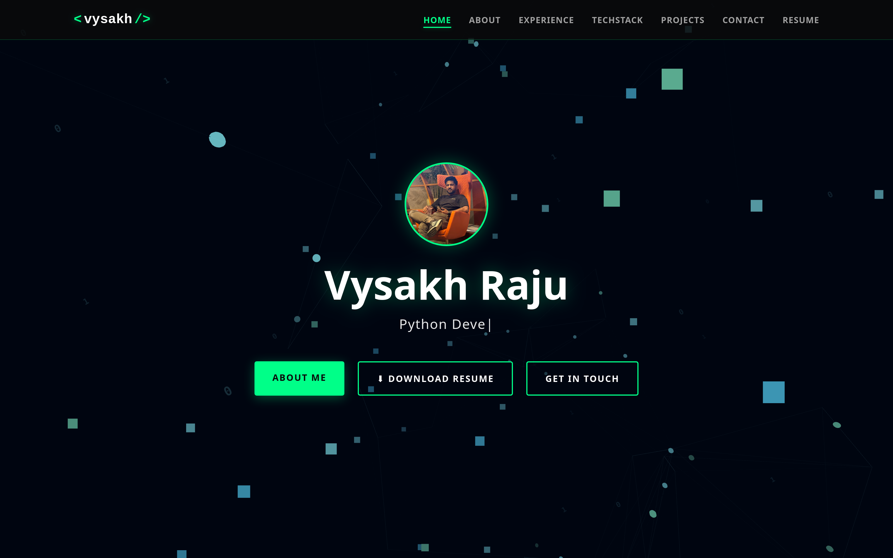

# ⚡ Vysakh Raju | Personal Portfolio

Hey there! Welcome to my personal portfolio space. I’m Vysakh Raju, a Python Developer and AI Systems Engineer with 5+ years of experience building full-stack web applications, custom local LLM setups, and real-time backend systems.

I built this website to showcase my projects, professional journey, and tech stack in a way that feels immersive, sleek, and highly interactive.



---

## 🎨 Interactive Experiences & Design

Rather than creating a standard template website, I wanted to build something that feels alive and tactile as you explore:

*   **Fluid WebGL Particle Field**: A background built with raw WebGL that flows organically and responds to your mouse movements, repelling particles as you hover.
*   **Custom Cursor & Magnetic Pulls**: An interactive trailing ring cursor. Call-to-actions, buttons, and social pills possess magnetic draw effects, drifting toward your mouse when you get close.
*   **3D Card Tilt**: Hovering over project cards, bento cells, or timeline records tilts them in 3D perspective following your cursor.
*   **Scroll Animations**: Smooth entrance reveals for page elements and a sleek gradient scroll progress bar at the very top of the window.
*   **Floating Navigation Dock**: A minimal pill-based nav dock at the top of the viewport. On mobile devices, it automatically adapts to top-aligned compact layouts and hides text labels, showing only the clear, tap-friendly icons.

---

## 🛠️ The Tech Behind It

*   **Markup & Styles**: Semantic HTML5 and Vanilla CSS3 with a clean, CSS variables-based custom dark mode design system.
*   **Zero Dependencies WebGL**: Custom WebGL vertex and fragment shaders written in raw WebGL (avoiding heavy external libraries like Three.js for fast load speeds).
*   **Animations & Logic**: Pure ES6+ JavaScript handling the scroll-state tracking, Intersection Observers, custom cursor movement, magnetic vector physics, and contact form handling.
*   **Serverless Contact Form**: Configured with [Formspree](https://formspree.io) to deliver messages directly to my inbox without running a custom mail server.

---

## 🚀 Running It Locally

Since the project uses ES6 Javascript modules (`import/export`), modern browsers prevent running it directly from your local filesystem due to security policies (CORS). You'll need to serve it using a lightweight local web server.

1.  **Clone the folder**:
    ```bash
    git clone https://github.com/vysakhrt/portfolio-website.git
    cd portfolio-website
    ```

2.  **Fire up a local server**:
    *   **If you have Python** (pre-installed on most macOS/Linux environments):
        ```bash
        python3 -m http.server 8000
        ```
        Then open your browser and navigate to `http://localhost:8000`.
    *   **If you use VS Code**: Install the **Live Server** extension and click the **Go Live** button in the bottom status bar.

---

## ⚙️ How to Personalize

If you are using this code as a template or checking it out, here is how you can customize it for yourself:

### 1. The Contact Form
To route messages to your own email:
1.  Sign up for a free account at [formspree.io](https://formspree.io/).
2.  Create a new form container and copy the endpoint URL.
3.  Open `index.html`, locate the `<form>` element, and update the `action` attribute:
    ```html
    <form action="https://formspree.io/f/YOUR_UNIQUE_FORM_ID" method="POST" id="contact-form">
    ```

### 2. Customizing the Typing Tags
To change the list of roles or titles typed out in the hero section, open `js/main.js` and edit the array in the `initTyping` function:
```javascript
const phrases = [
    'Python Developer',
    'AI Systems Engineer',
    'Full-Stack Developer',
    // add your own titles here!
];
```

### 3. Updating Social Handles & Details
Open `index.html` and search for the direct links pointing to my social handles (like LinkedIn and GitHub) and resume path, and replace them with your own.

---

## 📄 License

This portfolio is open-source and free to use. Feel free to clone it, tweak the styles, and build your own digital space!
